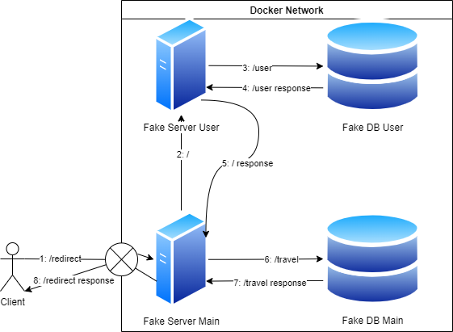

# Docker Miniserver

## This is a proof of concept for a Docker-based miniserver.

### Basically, it has servers and databases connected according to [this architectural diagram](arch.dio)

and makes comunications between them.

It all runs in Docker containers, and the containers are orchestrated by Docker Compose.

The fake servers and fake databases are written in [Go](https://golang.org/) and simply simulate normal requests and responses real applications would receive.

All dockers are based on the [official Go image](https://hub.docker.com/_/golang/). No requirements other than [Docker](https://www.docker.com/) and [Docker Compose](https://docs.docker.com/compose/) are needed. If you'd like, there is a Makefile to help you with the build and run process. The `up` and `test` targets are the most important.
